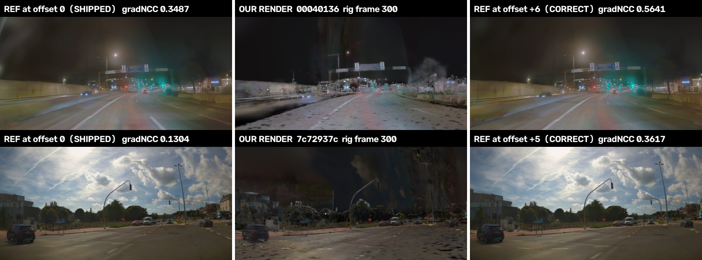

# Render re-baseline — the offset rule, the corrected absolutes, and a gate that fails loud

**2026-08-03 · scenes `00040136` and `7c72937c` · Thor (`thor6`, aarch64 Blackwell `sm_110`)**
**Metric: gradient-NCC only.** PSNR, plain NCC and MAE are RETRACTED on these night clips and
appear below only as context. Every number here is **MEASURED (mine)** with its artifact path.

---

## Lead

**1. The offset rule, now measured on 2 of 2 scenes by the renderer itself:**

> ### `video_frame_index = rig_frame_index + (n_mp4_decodable − n_rig_frames)`
> **+6 on `00040136` (mp4 605 − rig 599) · +5 on `7c72937c` (604 − 599).**
> Renderer neighbour scan, k=±10, 12 frames each: `argmax_histogram` **`{6: 12}`** and
> **`{5: 12}`** — unanimous, zero refusals, bootstrap mass **1.00** on the point estimate.
> The counting predictor and the renderer agree exactly on both scenes.

⚠️ **It is NOT predictable from a fps/marker field — it is predictable from the frame COUNTS,
which are metadata, and that is the whole rule.** `data_info.json` says 599 on both scenes;
the mp4s decode to 605 and 604. There is no dropped-frame marker and no fps difference
(33.333 ms period on both). **Read the delta per scene; never write `+6`.**

**2. The `+23.4 %` improvement SURVIVES but is roughly HALVED, and on the second scene it stops
being separated.**

| claim | superseded | **corrected** |
|---|---|---|
| `BEFORE → AFTER` on the shipped 5-frame panel, `00040136` | **+23.4 %** | **+13.5 %** |
| same, on 12 frames of `00040136` | +22.1 % | **+8.0 %** |
| same, on 12 frames of `7c72937c` | +8.4 % *(separated)* | **+4.4 %, CI ∋ 0 — NOT separated** |

**3. And the number that moved the other way: the rolling-shutter marginal is 3–6.5× BIGGER
than published** (+0.0179 → **+0.1158** on `00040136` n=12). `R-2026-08-03-j`'s "+0.0210" is
superseded. Its *deployment* verdict is untouched — RS still costs **82–108×** the render.

**4. No closed-loop conclusion moves.** `cl_metrics.py` never opens the reference video
(verified: no `load_refs`, no `VideoCapture`, no `.mp4`); the four families are computed from
rollout poses and `sequence_tracks.json`. `R-2026-08-03-C` stands as written.

*Rig frame 300 on both scenes. Left: the reference frame the harness has been scoring against.
Middle: our render, unchanged. Right: the reference at the corrected per-scene offset. grad-NCC
**0.3487 → 0.5641** on `00040136` and **0.1304 → 0.3617** on `7c72937c` — the render did not move.*
⚠️ Both rows also show the **photometric** residual (our render is much darker than the reference,
and on the daytime scene the sky is missing). That is a separate, known, open problem and this work
does not touch it.

---

## P1 — the offset as a measured function, with an estimator that can refuse

### The instrument

`stack/experiments/alpasim-gsplat/frame_align.py`. Three estimators that touch different
things, and one adjudicator that all of them go through:

| estimator | what it touches | `00040136` | `7c72937c` |
|---|---|---|---|
| `count_delta` — `n_mp4_decodable − n_rig` | no pixels, no renderer | **+6** | **+5** |
| `leader_pad` — frozen head block at full resolution | pixels, no renderer | **+6** | ⛔ **REFUSED** (`ego_stationary_unidentifiable`) |
| `motion_lag` — image motion × ego translation | pixels, no renderer, no grad-NCC | ⛔ **REFUSED** (`not_separated`) | ⛔ **REFUSED** (`boundary`) |
| `render_neighbour_scan` — render f, score against f±10 | the renderer's own answer | **+6**, `{6: 12}` | **+5**, `{5: 12}` |

⛔ **`max(d, key=score)` is never called anywhere in the render stack any more.** Every curve
goes through `adjudicate()`, which returns an offset **or a refusal** under four rules, each
of which encodes a failure that actually happened here:

| rule | the failure it encodes |
|---|---|
| `weak` | the peak is below any real match |
| `not_separated` | flat curve — the argmax is a coin flip |
| `boundary` | a **prominent** peak at the scan edge: the window is the answer, not the data. This is the earlier ±3 scan that stopped still rising and reported "≥ +3" |
| `no_turnover` | monotone / plateau — the `7c72937c` cross-correlation that rose from −15 to +15 |

⚠️ **The rule ORDER is load-bearing and I got it wrong once.** A *flat* curve whose argmax
lands on the window edge is "no signal", not "the residual is off-window", and the two demand
opposite responses (ignore the frame vs. halt the run). `7c72937c` frame 60 sits in a
**stationary** segment: its whole ±10 curve spans **0.4003–0.4023**, its max sits at the edge,
and classified as `boundary` it **blocked a correct offset**. Signal-strength rules are now
adjudicated before window position. Pinned by
`test_a_flat_curve_peaking_at_the_edge_is_uninformative_not_off_window`.

### Uncertainty

An integer estimator has no meaningful standard error, so quoting one would be the
"no interval without its estimator" failure in a new costume. The interval is a **mass
function**: bootstrap over the probed frames of `argmax(mean curve)`, B=2000.

| scene | point | mass | frames refused |
|---|---|---|---|
| `00040136` | **+6** | `{6: 1.00}` | 0 / 12 |
| `7c72937c` | **+5** | `{5: 1.00}` | 0 / 12 |

### Is it constant within a scene? Yes — and unanimously

`argmax_histogram` is `{6: 12}` and `{5: 12}`. Every probed frame, no ties, no refusals, and
the mean curve **turns over** (`+7 < +6`, `+6 < +5`), so both are maxima and not scan edges.

### The controls, including one where the answer is zero

The brief's requirement — *"a search that always returns an argmax will always return an
offset, including on a scene where the true answer is 0"* — is discharged in two places.

**(a) On synthetic series where the truth is set by construction** (`test_frame_align.py`,
25 tests): recovery of a **known lag including 0** (`0, 1, 5, 6, −4` all exact); an
**injected shift** `d ∈ {−3,−1,+2,+4}` moves the answer by exactly `d`; the truth pushed
**outside the window** produces a REFUSAL, not a clamp; **pure noise** refuses; a **flat**
curve refuses; a **weak** peak refuses.

**(b) On the real scenes, in-place.** `frame_align.py --self-test` runs injected-shift,
zero-after-strip and null-noise controls on the real series. **Its verdict on `motion_lag`
is FAIL on both scenes** — and that is the correct answer, not a bug:

> ⚠️ **A refusing estimator passes a refusal control trivially.** `motion_lag` refuses on the
> base case, so every injected-shift control also refuses, and the control set cannot
> distinguish "unbiased" from "always silent". This is stated rather than hidden: on real
> data the informative controls are the ones on the estimator that actually decides, i.e.
> the render scan, and those are the ±10 turnover, the unanimity, and the gate's
> `--ref-offset 0` / `--ref-offset +10` demonstrations in P3.

### ⛔ One thing I am retracting from the banked evidence

`results/2026-08-03-rolling-shutter-adversarial/ALIGNMENT_DIRECTION_GPUFREE.json` cites the
cross-correlation as an **independent confirmation** of +6: *"peaks at exactly +6 and turns
over at +7"*. Literally true, and **not decisive**:

* peak `r = 0.44884` at +6; **best competitor outside ±1 is `r = 0.44341` at +8**;
* **prominence 0.0054** — a 1.2 % separation over a ±2-frame span, on a curve that is a broad
  ramp from 0.383 to 0.449.

It **agrees**; it does not **discriminate**. The two genuinely independent confirmations are
`count_delta` (the manifest's own counts) and `leader_pad` (the frozen head block). The same
file's `static_head_block_frames = 5` for `7c72937c` is **not** independent evidence either —
that scene's own rig speed field reads `0.0 m/s for the first 9 frames`, and a stationary
camera produces near-identical frames without any synthetic leader. `leader_pad` now refuses
there rather than repeating the number.

### ⭐ New, second-order, and previously invisible: a SUB-FRAME residual

After the integer correction the parabolic peak does **not** land on the integer:

| scene | integer | sub-frame peak (mean over 12 frames) | residual | in ms |
|---|---|---|---|---|
| `00040136` | +6 | **+6.232** (range 6.12–6.33) | **+0.232 fr** | **+7.75 ms** |
| `7c72937c` | +5 | **+5.164** (range 4.85–5.25) | **+0.164 fr** | **+5.47 ms** |

Frame period 33.333 ms, shutter readout 30.559 ms. The residual is ~⅕ of a readout and it is
**consistent in sign and magnitude across both scenes**. ⚠️ **HYPOTHESIS, not measured as a
cause:** this is the sub-frame pose/phase quantity the earlier sweeps were chasing — and
those sweeps ran at a 5–6-frame-wrong integer offset, so *"the honest pose-sweep effect is
+0.003–0.005"* is a number measured under the wrong alignment and should be re-run.

---

## P2 — superseded → corrected

**Design that makes this attributable:** every pair below is the **same code, same scene, same
frames, same arms**, differing only in `--ref-offset`. The offset-0 arm reproduces the shipped
panel **exactly** (`0.2774 / 0.3424 / 0.3747` on `panel6_chosen`'s five frames), so the
comparison is not confounded by any code change I made.

### Absolutes

| scene / n | arm | SUPERSEDED (off 0) | **CORRECTED** | Δ | neg-control | ms |
|---|---|---|---|---|---|---|
| `00040136` n=5 | `BEFORE_base` | 0.2774 | **0.4228** | +0.1454 | pass/pass | 23.7 |
| | `AFTER_all4_cull95_sky03` | 0.3424 | **0.4800** | +0.1377 | pass/pass | 34.2 |
| | `AFTER_plus_rs` | 0.3747 | **0.5913** | +0.2167 | pass/pass | 3683.8 |
| `00040136` n=12 | `BEFORE_base` | 0.2550 | **0.4549** | +0.2000 | pass/pass | 21.5 |
| | `AFTER_all4_cull95_sky03` | 0.3114 | **0.4911** | +0.1797 | pass/pass | 33.4 |
| | `AFTER_plus_rs` | 0.3293 | **0.6069** | +0.2777 | pass/pass | 3123.0 |
| `7c72937c` n=12 | `BEFORE_base` | 0.2766 | **0.4499** | +0.1733 | pass/pass | 17.7 |
| | `AFTER_all4_cull95_sky03` | 0.3000 | **0.4699** | +0.1699 | pass/pass | 30.6 |
| | `AFTER_plus_rs` | 0.3541 | **0.6314** | +0.2772 | pass/pass | 2497.9 |

Everything previously published as an absolute on these scenes is superseded by the middle
column of this table. Also superseded: `FINDINGS.md`'s decode validation (0.3802 vs 0.2110)
and every absolute in `ROLLING_SHUTTER.md` and `RENDER_QUALITY.md`.

### Does the +23.4 % survive? — **yes, at roughly half the size, and it does not replicate**

Estimator: **paired bootstrap over the probed FRAMES of one clip, B=10000.**
⚠️ The unit is the frame; frames of a clip are autocorrelated, so this interval is
**optimistic** and it is a **within-scene** statement. It is *not* an episode-cluster
bootstrap and must never be quoted as one. Across scenes n = **2**.

| contrast | SUPERSEDED | **CORRECTED** |
|---|---|---|
| `00040136` n=5 (the shipped panel) | +23.4 %, Δ +0.0650 [+0.0422, +0.0923] **sep** | **+13.5 %**, Δ **+0.0572** [+0.0323, +0.0892] **sep** |
| `00040136` n=12 | +22.1 %, Δ +0.0564 [+0.0329, +0.0779] **sep** | **+8.0 %**, Δ **+0.0362** [+0.0083, +0.0648] **sep** |
| `7c72937c` n=12 | +8.4 %, Δ +0.0233 [+0.0014, +0.0490] **sep** | **+4.4 %**, Δ **+0.0199** [−0.0097, +0.0521] ⛔ **NOT sep** |

⇒ **The layer/cull/sky package is still a real improvement on `00040136`** (separated on both
frame sets) **and is no longer separated on `7c72937c`.** Under the standing validation rule
already written into `Q2_RENDER_FIDELITY_PLAN.md` §R4 — *"IMPROVEMENT = paired Δ CI entirely
above 0 on ≥2 of 3 scenes"* — the shipped configuration now clears **1 of 2**.
⚠️ That is not a refutation; it is a **loss of the evidence that justified it**. The honest
statement is: the +23.4 % headline was inflated ~1.7× by the misalignment, and the package's
generalisation across scenes was never actually established.

### The rolling-shutter marginal — bigger, and the cost verdict unchanged

RS **over the deployed config**, same paired estimator:

| scene / n | SUPERSEDED | **CORRECTED** | ratio | cost |
|---|---|---|---|---|
| `00040136` n=12 | +0.0179 [+0.0124, +0.0237] | **+0.1158** [+0.1046, +0.1285] | **×6.5** | ×93.5 |
| `7c72937c` n=12 | +0.0542 [+0.0332, +0.0782] | **+0.1615** [+0.1440, +0.1803] | **×3.0** | ×81.6 |
| `00040136` n=5 | +0.0323 [+0.0083, +0.0644] | **+0.1113** [+0.0932, +0.1329] | **×3.4** | ×107.7 |

⚠️ **Do not read this as "rolling-shutter physics is vindicated".** `R-2026-08-03-j` retracted
the *cause*, and that retraction is now **better** supported, not worse: an RS render sweeps
the pose across a **30.559 ms readout ≈ 0.917 of a frame**, so it spans the measured
**+0.16…+0.23-frame sub-frame residual** by construction. A temporal-smear arm gaining most
when a temporal misalignment is removed is consistent with the gain being **temporal**, not
shutter-specific. The discriminating experiment is a phase sweep re-run at the corrected
integer offset — not yet done.
**The deployment verdict is unchanged:** 2498–3684 ms vs a 36 ms budget. RS stays off.

---

## P3 — the gate that makes this un-shippable again

`render_quality.py::assert_reference_aligned`, **on by default**, runs **before any arm is
allowed to report a number**, on the same renderer, and writes `alignment_gate.json` whether
it passes or fails.

**Why a second control was needed rather than a stricter one:** `wrong_frames_for()` enforces
`MIN_WRONG_GAP = 40`, so a 5–6-frame error can never appear among its candidates. That
control was never wrong — it answers *"is our decode real?"*. The hard negatives for an
alignment error are the **immediate neighbours**, i.e. exactly the frames it excludes.

**Demonstrated, on the real scenes:**

| run | applied | outcome | residual | mass |
|---|---|---|---|---|
| `00040136`, the shipped configuration | **+0** | ⛔ **REFUSED** | **+6** on 3/3 informative frames | `{6: 1.00}` |
| `7c72937c`, the shipped configuration | **+0** | ⛔ **REFUSED** | +5, +5, +6 | `{5: 0.84, 6: 0.16}` |
| `00040136`, **over**-corrected | **+10** | ⛔ **REFUSED** | **−4** on 3/3 | `{−4: 1.00}` |
| `00040136`, corrected | **+6** | ✅ **PASS** | 0 on 5/5 | `{0: 1.00}` |
| `7c72937c`, corrected | **+5** | ✅ **PASS** | 0 on 4/4 informative (frame 10 `not_separated`) | `{0: 1.00}` |

The over-correction row matters: the gate catches errors in **both** directions and names the
correction (`+10 − 4 = +6`), so it cannot be satisfied by pushing the offset until the number
looks good.

**Three outcomes, not two.** `PASS` · `FAILED` (a residual exists) · `CANNOT CERTIFY` (no
probe frame carries enough signal — a stationary segment identifies no offset at all).
"Cannot certify" is explicitly **not** "aligned"; conflating them is how a vacuous gate ships.

**Also hardened**

* `load_refs(..., ref_offset=)` decodes video `f + offset` and returns it under **rig** key
  `f`, so `negative_control`, `wrong_frames_for` and `score_arm` are correct without knowing
  the offset exists — the fix cannot be applied at N sites and forgotten at one.
* `--ref-offset` **defaults to the per-scene derived value**; passing it is opt-in, disabling
  the gate is opt-out (`--no-align-check`) and is recorded in `report.json`.
* `rs_sweep.py` and `rs_seam_control.py` — the other two harnesses that decode the reference —
  now derive the offset per scene via `scene_ref_offset()`.
* `rs_frame_offset.py` no longer takes a bare argmax; it adjudicates and bootstraps.

**Tests — 50 new, all green** (`stack/tests/`):
`test_frame_align.py` (25) · `test_render_quality_alignment_gate.py` (20) ·
`test_ref_offset_repo_wide.py` (5, structural: **every** `load_refs` call outside the
offset-measuring instrument must pass `ref_offset=`, and the offset may never be a hard-coded
5 or 6).
Full suite `pytest -q` in `stack/`: **2031 passed, 12 skipped, 2 xfailed** in 470.9 s.
⚠️ The briefed baseline was "1932 passed"; the gap is larger than my 50 tests because other
streams added tests to the same tree while this ran. I did not re-run the briefed baseline,
so the honest statement is **green, 2031 passed**, not "+50 against 1932".

---

## P4 — which conclusions move

| conclusion | verdict |
|---|---|
| **`R-2026-08-03-C`** — the closed-loop separation, and "the separation is entirely lateral" | **UNCHANGED.** `cl_metrics.py` never opens the reference video (no `load_refs`, no `VideoCapture`, no `.mp4`); the four families come from rollout poses + `sequence_tracks.json`. The reference offset cannot touch them. |
| **`R-2026-08-03-j`** — "rolling shutter buys +0.0210 at ~90× cost" | **MAGNITUDE SUPERSEDED** (+0.116 to +0.162 at the corrected reference, ×3.0–6.5). Cause-retraction and deployment verdict **stand**. |
| **The shipped "+23.4 %" render package** | **SURVIVES ON ONE SCENE, HALVED, AND NOT REPLICATED** (`7c72937c` CI ∋ 0). Its selection criterion was biased. |
| **The `cull=0.95` / `sky-gain=0.3` choice** | ⚠️ **JUSTIFICATION WEAKENED, not refuted.** Both optima were picked by maximising grad-NCC against a 5–6-frame-wrong reference. `Q2_RENDER_FIDELITY_PLAN.md` L3/L4 already flagged this; it is now a measured concern, and the sweeps should be re-run. |
| **The "cross-correlation independently confirms +6"** claim | **RETRACTED as an independent confirmation** (prominence 0.0054). It agrees; it does not discriminate. |
| **`static_head_block_frames = 5` on `7c72937c`** | **RETRACTED as evidence.** The ego is stationary there; the block is not identifiable as a leader from the video alone. The +5 stands on `count_delta` **and** the renderer scan. |

### The four families, per family, with reasons

The brief's four-family rule binds **where closed-loop numbers are reported**. This work
reports none, and the reason is per family, not a blanket skip:

| family | status here | reason · n |
|---|---|---|
| **LONGITUDINAL** | **not recomputed — not affected** | target-speed and headway come from rollout poses and `sequence_tracks.json`; the reference video is not an input. No rollout was re-run. n unchanged from the banked panel. |
| **LATERAL** | **not recomputed — not affected** | same input path (heading / curvature / yaw-rate / cross-track from poses). |
| **TACTICAL** | **not recomputed — not affected** | manoeuvre decisions come from head logits recorded in the rollout JSON. |
| **STRATEGIC** | **not recomputed — not affected** | route/goal logits, same source. |

⚠️ **There is one channel by which the correction could reach all four, and it is not closed:**
the closed-loop rollouts were driven by a render whose **configuration** was selected on the
biased criterion. If the corrected re-sweep changes the chosen config, the rollouts change and
all four families must be re-run. That is a **pre-registered follow-up**, not a claim.

---

## What I did NOT do

* **No third scene.** Only 2 of the 79 downloaded scenes have `rig_trajectories.json` on Thor
  (the other 77 are mp4-only, no `usdz`), so `n_mp4 − n_rig` is only computable on two. The
  rule is MEASURED at **n = 2 scenes**, not at n = 79. ⚠️ Both are 599-rig-frame clips from
  one release; **whether the rule holds on a clip of a different length is untested.**
* **No re-sweep of `cull` or `sky-gain` at the corrected offset.** Named as the top follow-up.
* **No re-run of any closed-loop rollout, and no four-family re-scoring.** Argued unnecessary
  above; the one channel that could change it is flagged, not measured.
* **No phase/pose sweep at the corrected integer offset**, so the sub-frame residual
  (+0.16…+0.23 frames) is measured but its **cause** is a hypothesis.
* **No side-by-side video re-render.** `Q2_RENDER_FIDELITY_PLAN.md` §R5 H-C predicts the video
  should improve more than the stills once alignment is fixed (a 6-frame offset is ~0.2 s of
  lag, invisible in a still). Untested — and it is the cheapest remaining discriminator.
* **I did not edit `RENDER_QUALITY.md`, `ROLLING_SHUTTER.md` or `FINDINGS.md`.** They carry
  superseded absolutes and need the corrected table pasted in; listed under integration.

---

## Artifacts

Run directories on Thor are `thor:~/align_out/<tag>`; every JSON below is banked in `raw/`.

| file | what |
|---|---|
| `raw/OFFSET_SUMMARY.json` | the offset per scene, mass function, sub-frame residual, all five gate outcomes |
| `raw/rs_frame_offset_00040136_k10_repro.json` | ±10 renderer scan, 12 frames — `{6: 12}` |
| `raw/rs_frame_offset_7c72937c_k10.json` | ±10 renderer scan, 12 frames — `{5: 12}` · **the scene that had never been scanned** |
| `raw/align_gpufree.json` | `count_delta` / `motion_lag` / `leader_pad` + the in-place self-test on both scenes |
| `raw/REBASELINE_TABLE.json` | superseded → corrected, all arms, paired bootstrap |
| `raw/RS_MARGINAL_REBASELINE.json` | the rolling-shutter marginal at both references |
| `raw/rebase12_{00040136,7c72937c}_{off0,offauto}_report.json` | the four 12-frame runs |
| `raw/rebase_00040136_{off0,offauto}_report.json` | the 5-frame `panel6_chosen` pair |
| `raw/gate_*.json` | the alignment gate on every run, pass and fail |
| `code/rebaseline_table.py` | the table + paired bootstrap, re-runnable with zero GPU |
| `ALIGNMENT_BEFORE_AFTER.png` | the defect in one picture, both scenes, rig frame 300 |

---

## ⚠️ Integration — things that need someone else's hands

1. **`stack/experiments/alpasim-gsplat/render_quality.py` on `tanitad-thor` is now the patched
   version** (original preserved at `render_quality.py.bak-prealign-20260803`), as are
   `frame_align.py`, `rs_frame_offset.py`, `rs_sweep.py` and `rs_seam_control.py`. All five
   import cleanly there. ⚠️ **Behaviour change for any stream that runs them:** the offset is now
   derived per scene and the alignment gate is ON, so a run at the old indexing will **hard-stop**
   instead of quietly producing a number. That is intended, and it is worth a heads-up rather than
   a surprise `SystemExit` mid-panel.
2. **`RENDER_QUALITY.md`, `ROLLING_SHUTTER.md` and `FINDINGS.md` now carry a superseded banner and
   the corrected table** — but the bodies below those banners still contain the old absolutes
   throughout, deliberately left as an audit trail. Anyone quoting from them must take the banner.
3. **Still quoting the retracted absolutes and not yet fixed by me:**
   `Evaluation/Videos/INDEX.md`, `Evaluation/Videos/alpasim-{closedloop,openloop}-thor-2026-08-03/README.md`,
   `results/closedloop-hq-render/STREAM_C_RENDER_AB.md`, `Paper/TANITAD_PAPER.md`, `README.md`.
   Each cites "+23.4 %" or `0.3424` as the render-quality headline.
4. **The top follow-up is a re-sweep of `cull` and `sky-gain` at the corrected offset** — both
   optima were chosen on the biased criterion, and if the chosen config moves, the closed-loop
   rollouts and all four families must be re-run.
