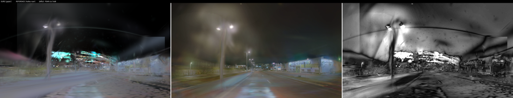

# ⭐ CRACKED: NuRec scenes render on the Jetson Thor with gsplat

**MEASURED 2026-08-02, Thor (aarch64 Blackwell `sm_110`).** The one open unknown blocking
AlpaSim-on-Thor — *does the NuRec gaussian payload map onto gsplat's parameterisation?* — is
**ANSWERED YES**. We can render NVIDIA's neural reconstructions ourselves, on the edge device,
without the closed x86-only NRE binary.

*Left: our gsplat render. Middle: NVIDIA's shipped `camera_front_wide_120fov.mp4` frame 0.
Right: difference.*

## The falsifier, and what it says

The scene ships its own reference video, so a wrong mapping cannot hide behind a plausible-looking
image. Frame 0, `background + road` layers:

| metric | value |
|---|---|
| gaussians rendered | **3,105,514** |
| render time | 224.98 ms (frame 0, unoptimised, 1920×1080) |
| mean alpha | 0.5145 |
| dropped gaussians | background 348, road 0 |
| **PSNR** | **16.758 dB** |
| MAE | 0.1174 |
| ref mean / render mean | 0.2659 / 0.2404 |
| **PSNR after affine colour fit** | **20.689 dB** |
| affine gain/bias per channel | R (0.485, 0.167) · G (0.446, 0.166) · B (0.434, 0.137) |

**Geometry, camera pose and scene content are unmistakably correct** — the same street lamp in the
same place, the same road vanishing point, the same buildings, the same lit signage. That is the
claim the reference exists to test, and it passes by inspection, not just by a scalar.

⚠️ **It is NOT yet a pixel match, and the numbers say where the gap is.** A near-identical affine
gain on all three channels (**0.485 / 0.446 / 0.434**, i.e. ~0.45) is the signature of a **colour-space
transfer error, not a geometry error** — almost certainly linear-vs-sRGB, and the file itself
declares `config/background/composite_in_linear_space: False`. Visible artifacts: a black band top-left
(FOV/coverage), a magenta smear bottom-left (a bad gaussian cluster or a missing layer), and general
haze (the sky env-map cubemap is not yet composited — `--sky` was off).

⇒ **Do not quote 16.758 dB as "the render quality".** It is the quality of a render with an
un-corrected colour transform and no sky. The honest statement is: *the payload decodes and the
scene reconstructs; photometric agreement is not yet established.*

## What the loader established about the format

- `volume.nurec` = **gzip → plain MessagePack**. No proprietary container.
- Every array carries an **explicit `<key>.shape` list** in the file — shapes are read, not guessed.
- Dtype is **float16**, *proven* by cross-checking every declared shape against its raw byte count
  (`nurec_loader.py`) rather than assumed.
- Band-0 SH constant `C0` with the standard `colour = 0.5 + C0·dc` convention (gsplat applies the
  `+0.5` internally).
- Layers present: `background`, `road`, `dynamic_rigids`, `dynamic_deformables`. **Only the first
  two are rendered here — dynamic actors are out of scope for this pass.**

## Next, in order

| # | step | note |
|---|---|---|
| 1 | Fix the colour transform (linear↔sRGB) and re-diff | the affine gain says this is most of the remaining error |
| 2 | Composite the sky env cubemap (`--sky`) | removes the haze |
| 3 | Investigate the magenta smear + black band | localised, not global |
| 4 | Wrap as a `sensorsim.proto` gRPC service, **front camera only** | PI's explicit steer |
| 5 | `alpasim_wizard … renderer=<ours> driver=<tanitad/refc/flagship-v1>` | adapters already exist |
| 6 | LONG closed-loop videos: front camera + overlays + BEV | the deliverable |

⚠️ **Perf note:** 225 ms/frame at 1920×1080 with 3.1 M gaussians is **~4.4 FPS**, not the 492 FPS
measured on the 20 k-gaussian synthetic probe. Closed loop at 10 Hz needs work — but the front
camera alone at a lower raster (the PI's steer) is a large reduction, and this figure includes
first-call overhead. **Re-measure before treating it as the deployment number.**

## Evidence class

| claim | class |
|---|---|
| every metric in the table | **MEASURED (ours)** — `render_probe.py` on Thor, artifact `out/sbs_frame0000_f0_background-road.png` |
| "geometry and pose are correct" | **MEASURED by inspection** of the banked side-by-side |
| "the residual is a colour-space transfer" | ⚠️ **HYPOTHESIS** — strongly supported by the near-equal per-channel gains + the file's own `composite_in_linear_space: False`, **not yet confirmed by a corrected re-render** |
| 4.4 FPS is the deployment rate | ⛔ **NOT ESTABLISHED** — one unoptimised frame at full 1080p with sky off |
